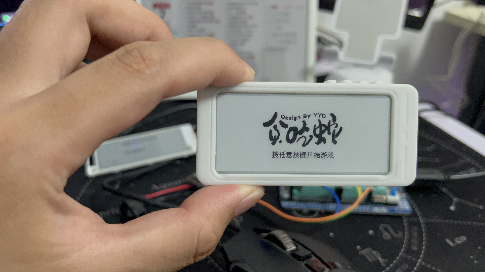
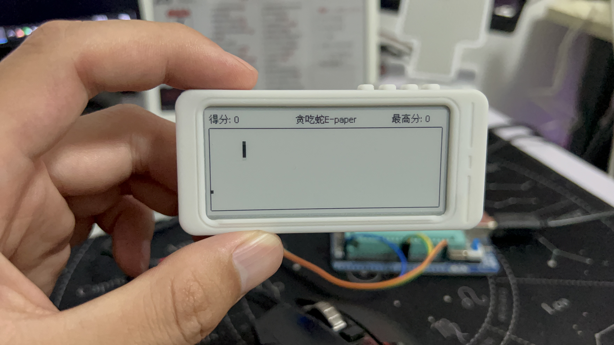
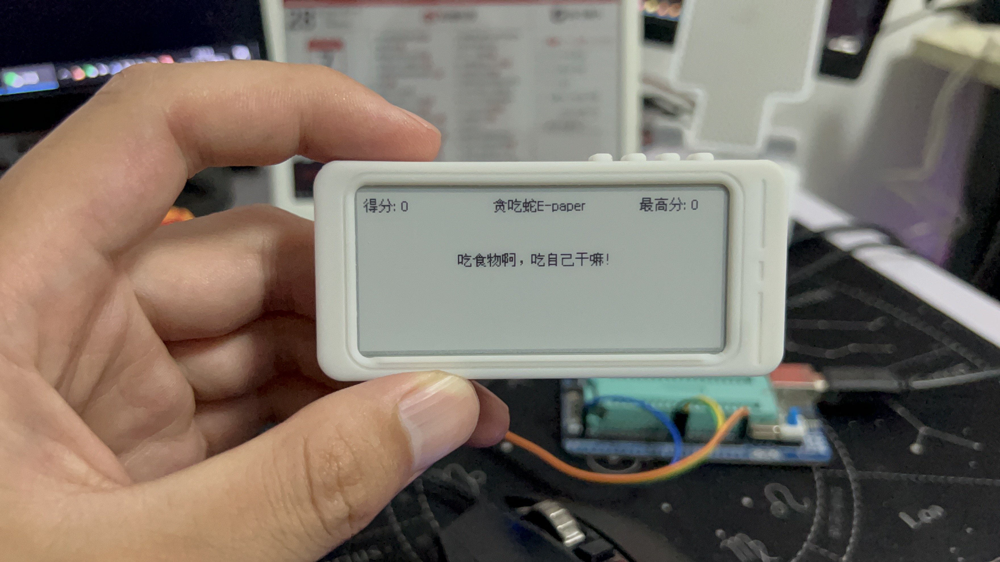
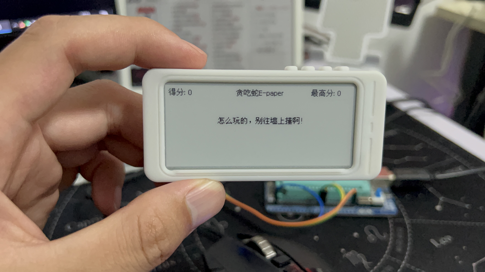

## 2.9寸墨水屏贪吃蛇小游戏

### 项目简介
此项目使用ESP32驱动2.9寸墨水屏，实现贪吃蛇小游戏
- **B站视频演示地址：[点击观看视频](https://www.bilibili.com/video/BV1CV4y127RS)** 
- QQ交流群：1051455459  

### 需要的环境
- Arduino IDE  

### 使用的硬件
- ESP32开发板+2.9寸墨水屏+外壳（闲鱼搜记得带马扎，可以购买整套，这个新买的，里面自带系统可以看小说，还不错）（代码ESP8266也能用）  
- 3.7v锂电池  

### 代码使用说明

- 注意！通过arduino编译上传后，第一次使用需要先同时按两个按键，格式化flash，这样最高分才能存进flash  
- 如果使用ESP8266或者跟我不一样的屏幕记得更换调用屏幕驱动那行代码  

### 整个逻辑介绍

- 程序上电后会先显示一个logo，此时按键是没有反应的，需要等logo显示完  
- 然后按任意按键可以进入游戏  
- 左上角实时记录当前分数，右上角在破记录后会更新，并且存入flash里面，断电再上电同样存在  
- 贪吃蛇碰到墙跟自己的身体都会死亡，有相应的提示，同时如果破纪录，也会有相应的提示  
- 两个按键，一个顺时针转动蛇头，一个逆时针转动蛇头  
- 两个按键同时按一次，可以格式化flash中的内容，擦除最高分记录  

### 存在的bug
- [ ] 有一定几率复活的时候会直接判定撞到身体，排查了一整天也没找到原因，待完善  

### 实物图效果展示

  
- enjoy
